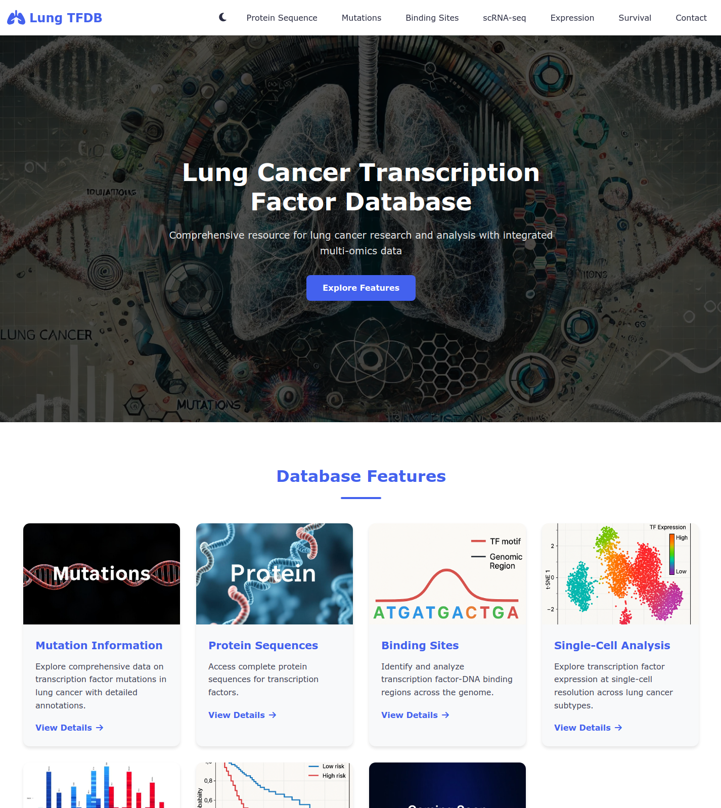

# Lung-TFDB: The Lung Cancer Transcription Factor Database

[](https://github.com/RustyAlgorithm44/Lung_TFDB/stargazers)

Lung-TFDB is a comprehensive web-based resource for lung cancer research and analysis, with a focus on integrated multi-omics data for transcription factors (TFs). It provides an interactive platform for researchers to explore, analyze, and visualize complex biological data.

**Live frontend preview:** [https://rustyalgorithm44.github.io/Lung_TFDB/](https://rustyalgorithm44.github.io/Lung_TFDB/)



---

## 📋 Features

This database provides a suite of tools for comprehensive TF analysis in the context of lung cancer:

-   **🧬 Protein Sequence Analysis:** Retrieve and download protein sequences for transcription factors.
-   **📊 Mutation Analysis:** Explore comprehensive data on TF mutations, with detailed annotations and OncoPlot visualizations.
-   **🔗 Binding Site Identification:** Identify and analyze transcription factor-DNA binding regions across the genome.
-   **🔬 Single-Cell (scRNA-seq) Analysis:** Explore TF expression at single-cell resolution across different lung cancer subtypes.
-   **📈 Gene Expression Comparison:** Compare TF expression levels between tumor and normal tissues using data from various sources.
-   **❤️ Survival Analysis:** Perform Kaplan-Meier survival analysis to visualize patient outcomes based on TF expression levels.
-   **❓ User Support:** A built-in contact form for inquiries and an admin dashboard for managing them.

---

## 💻 Technology Stack

-   **Frontend:** HTML5, CSS3, JavaScript (ES6+)
-   **JavaScript Libraries:**
    -   [jQuery](https://jquery.com/) for DOM manipulation and AJAX.
    -   [Font Awesome](https://fontawesome.com/) for icons.
-   **Backend:** PHP
-   **Data Analysis & Visualization:** The backend leverages **R** for statistical computing and generating plots (e.g., survival analysis).
-   **Hosting Environment:** Designed for a standard WAMP (Windows, Apache, MySQL, PHP) or LAMP (Linux) server stack.

---
## 📂 File Structure

The repository is organized as follows:

```
/
├── admin/              # Admin dashboard PHP files
├── css/                # Main stylesheets
├── files/              # Data files for analysis
├── images/             # Site images and plot examples
├── js/                 # JavaScript files (main.js, jQuery)
├── php/                # Backend PHP scripts for data fetching and analysis
├── plots/              # Directory for saving generated plots
├── *.html              # Main HTML pages for each feature
└── .gitignore          # Git ignore file
```

---

## 📚 Data Sources

The data integrated into Lung-TFDB is compiled and curated from several high-quality public repositories:

-   **The Cancer Genome Atlas (TCGA)**
-   **Gene Expression Omnibus (GEO)**
-   **cBioPortal for Cancer Genomics**
-   Other relevant scientific publications.

---

## 📞 Contact & Credits

-   **Developer:** Guruguhan S ([LinkedIn](https://www.linkedin.com/in/guruguhan-s/))
-   **Lab/Affiliation:** [Akkis-Lab](https://akkis-lab.github.io/ott-lab/index.html)
-   **Copyright:** © 2025 SSNCCPR. All rights reserved.

For inquiries, please use the [Contact](contact.html) form on the website.